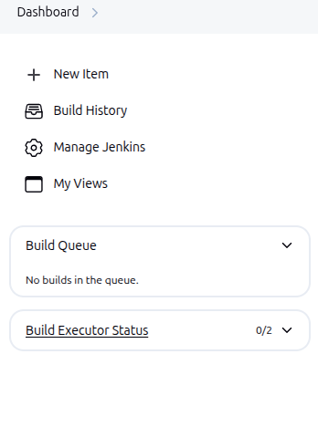
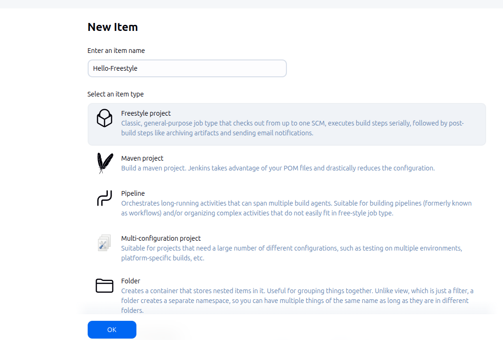
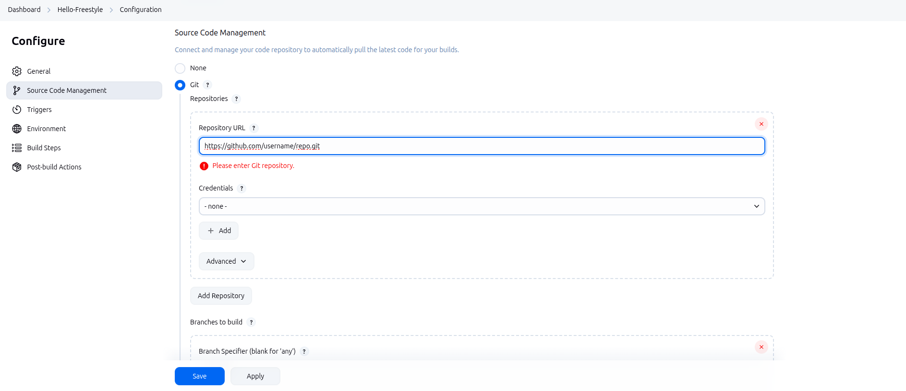
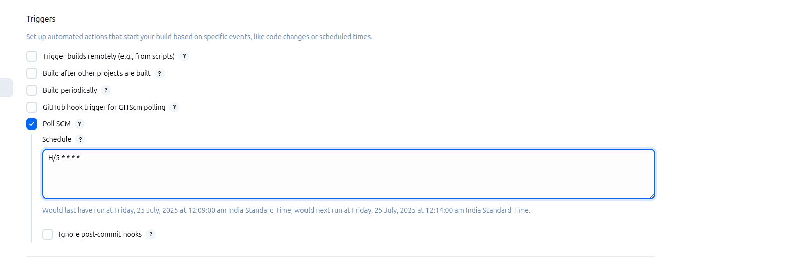
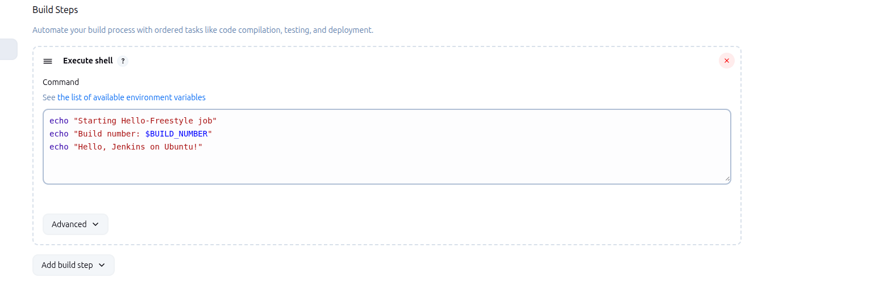
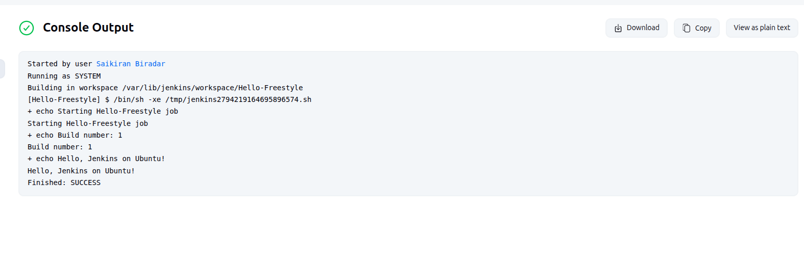

# 01. Accessing Your Jenkins Dashboard
- Open your browser and navigate to http://localhost:8080
- Log in with your Jenkins admin credentials.

# 02. Creating a New Freestyle Job
- On the left sidebar, click **New Item**.

- In Enter an **item name**, type a descriptive name (e.g., Hello-Freestyle).
- Select **Freestyle project** and click **OK**.
- Upon clicking OK, Jenkins opens the job’s configuration page

# 03. Configuring the Job

**a. General**

- **Description:** (Optional) Briefly describe the job’s purpose.

**b. Source Code Management (SCM)**
- If your code resides in Git/GitHub, select Git and enter:
- Repository URL (e.g., https://github.com/username/repo.git)
- Credentials if it’s private
- Otherwise, select None.

**c. Build Triggers**
- Choose how builds start automatically:
- **Poll SCM** (e.g., H/5 * * * * to check every 5 minutes)
- **Build periodically**
- **GitHub hook trigger for GITScm polling** (via webhooks)

# 04. Build Steps
- Click **Add build step → Execute shell**.
- In the **Command** box, enter a simple shell script. For example:
  echo "Starting Hello-Freestyle job"
  echo "Build number: $BUILD_NUMBER"
  echo "Hello, Jenkins on Ubuntu!"

# 05. Running Your Freestyle Job
- Click on **Save**.
- On the job’s page, click **Build Now**.

# 06. Verifying Results
- Click the build number under **Build History** on the left.
- Select **Console Output** to view logged messages and confirm that each echo ran successfully.

