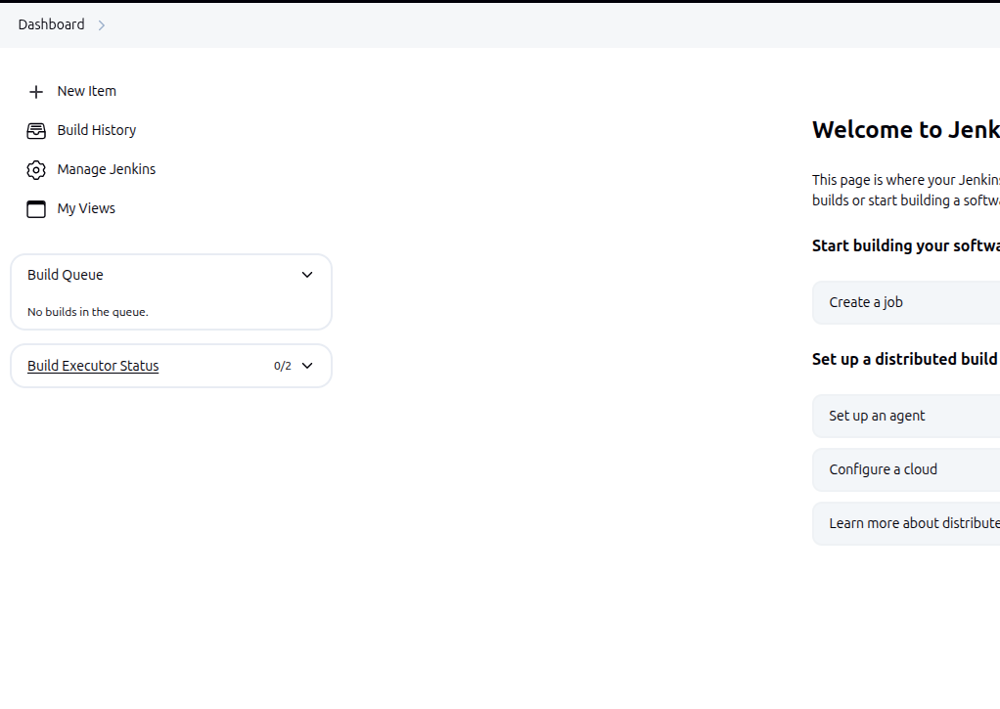
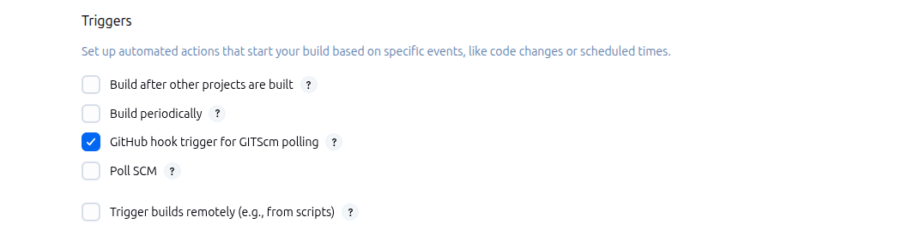

# 01. Here is a minimal Jenkinsfile that fulfills your hands-on test requirements:
- Create a minimal Jenkinsfile that:
  a. Checks out a public Git repo.
  b. Echoes “Hello, Jenkinsfile!”.


- Write the **Jenkinsfile** in your projects root directory
```
pipeline {
    agent any

    stages {
        stage("Git Checkout") {
            steps {
                git(
                  url: 'https://github.com/Saikiran121/VotingApp.git',
                  branch: 'master'
                )
            }
        }

        stage("Greetings") {
            steps {
                echo "Hello, Jenkinsfile!"
            }
        }
    }
}
```

- Login to **Jenkins** and click on **New Item**
  


- **Enter an Item name** and then click on **pipeline** Then **OK**
  


- **Build Triggers (Optional but Recommended):** Check **GitHub hook trigger for GITScm polling** if you want automatic builds when you 
  push to GitHub

- This requires **setting up a webhook in your GitHub repository later.**
  

# Pipeline Configuration
- This is the most important par
- In the **"Pipeline"** section, find the **"Definition"** dropdown
- Select **"Pipeline script from SCM"**
- In the **"SCM"** dropdown, choose **"Git"**
- In the **"Repository URL"** field, paste your public **GitHub repository URL**
- Leave **"Credentials"** empty since it's a public repository.
- In **"Branch Specifier"**, ensure it shows ***/master**
- In **"Script Path"**, type Jenkinsfile (this tells Jenkins to look for the Jenkinsfile in your repository root)
  

- Click on **Save** and then click on **Build Now**


  